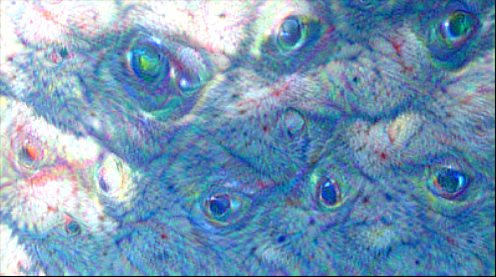

# DeepDream

## 1. 简介

DeepDream是神经网络可视化的一种方式，可以对给定图片进行增强，生成一些有趣的结果。其主要方法是将图片输入（固定的）预训练的网络，通过对图片的梯度上升增大网络在某一层响应的二范数，从而使网络提取出的主要特征在图片中不断放大。通过增强的图片，我们可以直观了解到网络的每一层学到（或者看到）了什么特征。

DeepDream的一个升级版本是使用特定图片指导“梦境”，即使得一幅图片A上增强的内容具有另一幅给定图片B的特征。其实现方法是将图片A与图片B分别输入网络，得到A与B在某一层的响应A'与B'，然后对于A'的每个点，找到B'中特征最相似的点作为目标，从而得到A'的目标值A\*，通过对图片A的梯度下降减小A'与A\*的均方误差。

## 2. 实验过程

实验代码使用TensorFlow 1.11编写。实验中先后尝试了Inception v1与ResNet-50 v2的预训练模型。

### 2.1 DeepDream with Inception

实验初期遇到的最大问题是如何从预训练模型文件中读取网络结构和恢复网络参数。在以往的实验中，网络的搭建都在自己的代码里实现，模型的保存和读取只涉及checkpoint文件，其中不包含网络结构。然而，很多网上公开的预训练模型，如[github上TensorFlow官方提供的模型](https://github.com/tensorflow/models)，会将网络结构也导出成特定格式的文件，而搭建网络的代码可能不方便修改或无法获取。因此，必须从文件中读取网络结构，恢复张量图，并载入各变量的值。由于初次接触，代码实现存在一定困难，我参考了[github上的一个实现](https://github.com/llSourcell/deep_dream_challenge)，在此基础上进行修改。

在基本方法之上，实验中还用到了两个重要的技巧：

- 多尺度递归优化：将原图缩放为不同的尺度，先在较小尺度的图片上进行梯度上升的优化，然后把得到的增强细节加到更大尺度的图片上进一步优化并丰富细节。
- 分块求梯度：将图片划分成多个块，每个块独立地输入网络并求出梯度。这主要是为了节省显存。划分块时，为了避免对不同尺度图片的划分线重叠导致生成的图片中出现分块效应，需要先将图片进行随机的平移（实际上为rolling）。

代码：[deepdream.py](deepdream.py)

### 2.2 DeepDream v2 with Inception

对基础DeepDream的代码进行修改，实现升级版的DeepDream，即通过给定图片指导“梦境”。基本原理如简介部分所述，而实现方式参考了[一篇博客](https://www.jianshu.com/p/1ee5f5423850)，使用两个点的特征向量的内积衡量两个点的相似度。此外，为了产生更好的效果，我进行了图片缩放，使两张图片的尺寸相近。

代码：[deepdream_v2.py](deepdream_v2.py)

### 2.3 DeepDream with ResNet

由于前面基于Inception v1的实验效果一般，我尝试改用ResNet。TensorFlow官方提供了几个版本的ResNet预训练模型，然而这些模型有一个很不友好的地方：输入张量的形状是固定的，批大小必须为64，图片尺寸必须为224x224。因此，在用于实现DeepDream时，需要做一些额外的处理，例如必要的补零操作（分块求梯度时块大小必须为224x224），以及将尺寸过大的图片缩小（否则224x224的块大小可能太小，效果不好）。

张量形状固定带来的另一个严重的问题是所需的显存固定（8G左右），我无法在自己的笔记本显卡上完成。于是，我选择在[Google Colab](https://colab.research.google.com)上完成实验。

在这一部分的实验中，我重写了绝大部分的代码，其中一些细节参考了[github上的另一个实现](https://github.com/L1aoXingyu/Deep-Dream)。在notebook中我附上了一些关于实现的具体的说明和注释。

由于模型限制，不方便实现升级版的DeepDream。

Notebook: [deepdream_resnet.ipynb](deepdream_resnet.ipynb)

Notebook on Google Colab: https://colab.research.google.com/drive/10J8yBMUwi6IRg1KfHQtUV1IbC7EijUm7

## 3. 实验结果

### 3.1 DeepDream with Inception

在天空图片上，使用Inception v1得到的效果与[这篇博客](https://www.jianshu.com/p/1ee5f5423850)使用ResNet-50得到的有很大差距。Inception得到的基本是重复的局部图案，而ResNet可以产生较大尺寸的、有明显实物特征（如狗头、塔）的图案。

我还尝试了[Github - hjptriplebee/deep_dream_tensorflow](https://github.com/hjptriplebee/deep_dream_tensorflow)中使用的图片，得到了一些更好的效果。并且，对同一幅图使用不同的参数，可以得到截然不同的结果。

 

### 3.2 DeepDream v2 with Inception

使用Inception实现的升级版DeepDream效果也不如ResNet，但仍然有一定的效果。下图是天空图片作为背景，小猫图片指导“梦境”得到的结果。可以看到，天空中产生了几个猫眼，并且遍布着猫的毛发的纹理。

### 3.3 DeepDream with ResNet

可能是因为模型的张量形状固定的问题，我用ResNet实现的DeepDream效果也不理想。[博客](https://www.jianshu.com/p/1ee5f5423850)中的效果是使用ResNet最后一部分（第4块）的输出作为优化目标实现的，我使用相同的设置得到的图片几乎看不出显著的特征，并且随着迭代次数增加越来越像噪声。后来我改用ResNet第3块的输出作为目标，可以得到较好的效果，尽管增强的特征相对低级，例如是眼睛、毛发或其他一些图案和纹理。

（原图及更多的图片见[pic文件夹](pic)）

## 4. 收获与心得

本次实验花费了较多的时间和精力，也有了多方面的收获，简单总结如下：

- 学习了TensorFlow读取和使用预训练模型的方法。事实上，为了查看模型中有哪些层的输出可以用作DeepDream的目标，我编写了[两个脚本](utils)，从不同类型的模型文件中读取张量图并输出所有的operation。有关模型读取的一些资料整理如下：
    - [StackOverflow上关于不同的模型读/写方式的问题]( https://stackoverflow.com/questions/38947658/tensorflow-saving-into-loading-a-graph-from-a-file)
    - [TensorFlow官方教程 - SavedModel](https://www.tensorflow.org/guide/saved_model#build_and_load_a_savedmodel)
    - [TensorFlow官方教程 - GraphDef](https://www.tensorflow.org/guide/extend/model_files#graphdef)
    - 公开的预训练模型
        - [MuffinTech - Directory of Pretrained AI](https://www.muffintech.org/blog/id/7/)
        - [Tensorpack Model Zoo](http://models.tensorpack.com/)
- 学会使用Google Colab。Colab不仅提供了一个基于Google Drive的IPython Notebook服务，还为会话提供了一套虚拟机环境，可根据需要安装库，并且可以选择使用GPU加速（显卡是NVIDIA Tesla K80，实际可用显存约为12GB）。Colab适合学习和教育使用。
- 通过DeepDream的可视化，增进了对CNN的认识。

## Reference

- TensorFlow Model Zoo: https://github.com/tensorflow/models
- Github - llSourcell/deep_dream_challenge: https://github.com/llSourcell/deep_dream_challenge
- Github - L1aoXingyu/Deep-Dream: https://github.com/L1aoXingyu/Deep-Dream
- Github - hjptriplebee/deep_dream_tensorflow: https://github.com/hjptriplebee/deep_dream_tensorflow
